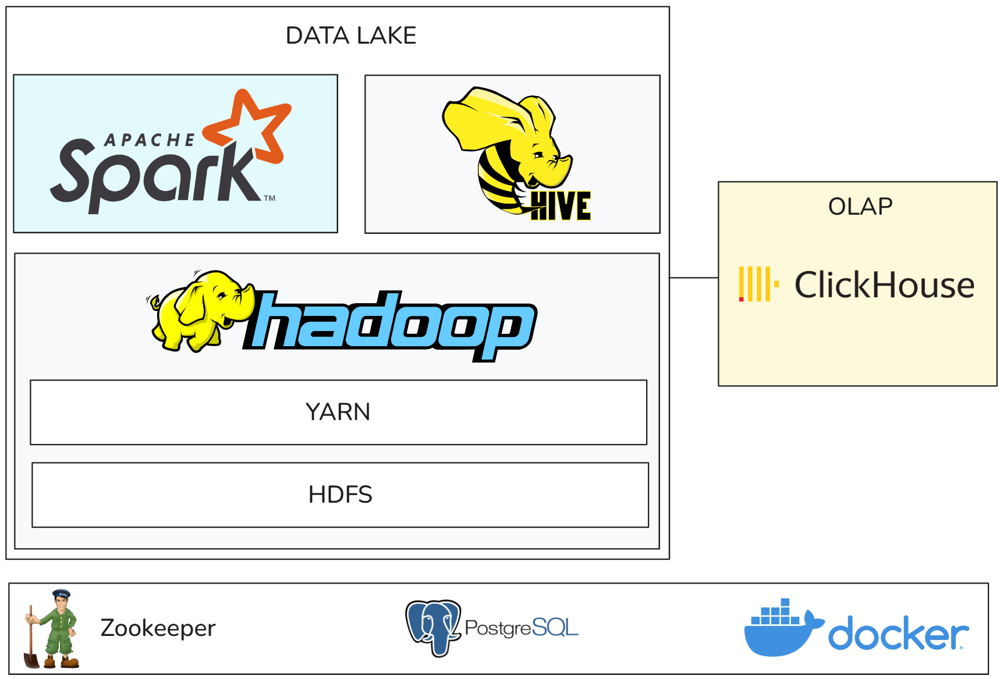

# On-premise Data Platform with Hadoop, Spark and YARN

A local multi-container environment designed to simulate real-world on-premises enterprise Big Data architectures (commonly used in banking, telecommunications, and large enterprises that rely on Apache Hadoop as their core data platform).

This project provides a practical sandbox for hands-on learning, architectural comprehension, and performance tuning across the full data lifecycle: **HDFS (Distributed Storage) ➔ YARN (Resource Management) ➔ Apache Spark (Distributed Compute) ➔ Apache Hive (Metastore) ➔ Apache Airflow (Workflow Orchestration) ➔ ClickHouse (OLAP Serving Layer)**.

---

## 1. Architecture

<p align="center">
  
</p>

---

## 2. Core Practice & Optimization Areas

This lab is structured to practice standard performance tuning and operational scenarios encountered in production Hadoop/Spark environments:

1. **HDFS Storage & Data Locality**:
   - Understanding block sizing, replication policies, and NameNode namespace overhead.
   - Managing and preventing the small files problem via compaction.
2. **YARN Resource Management**:
   - Allocating NodeManager memory (`yarn.nodemanager.resource.memory-mb`) and virtual cores.
   - Managing containers, ApplicationMasters, and Capacity Scheduler queues.
3. **Spark on YARN Performance Tuning**:
   - Memory sizing: Driver vs. Executor heap and `spark.executor.memoryOverhead`.
   - Shuffle tuning, Adaptive Query Execution (AQE), and data skew mitigation.
   - Optimizing execution via partitioned columnar formats (Parquet with Snappy compression).
4. **Hive Data Warehouse & Metastore Modeling**:
   - Decoupled Metastore architecture backed by PostgreSQL.
   - Managing external tables, schema evolution, and partition pruning.
5. **Data Pipeline Orchestration (Apache Airflow 3.2.1)**:
   - Scheduling & chaining end-to-end Medallion pipelines (Raw ➔ Stage ➔ Curated ➔ Serving).
   - Managing DAG dependencies, automated retries, dynamic parameters, and cluster health monitoring.
6. **Modern OLAP Serving (ClickHouse)**:
   - Offloading high-concurrency analytical queries from the data lake to ClickHouse.
   - Designing MergeTree primary keys and partition strategies for sub-second dashboard queries.

---

## 3. Cluster Components (10 Containers)

| Container | Host Ports | Services & Responsibilities |
| :--- | :--- | :--- |
| **`master`** | `9870`, `8088`, `18080`, `19888`, `9083`, `9000` | HDFS NameNode, YARN ResourceManager, Hive Metastore, Spark History Server |
| **`worker1`** | Internal | HDFS DataNode 1, YARN NodeManager 1 |
| **`worker2`** | Internal | HDFS DataNode 2, YARN NodeManager 2 |
| **`clickhouse`** | `8123` (HTTP), `9004` (Native TCP) | ClickHouse OLAP Server for real-time analytical queries |
| **`hive-db`** | `5432` | PostgreSQL 15 RDBMS storing Hive Metastore schema |
| **`zookeeper`** | `2181` | ZooKeeper 3.8 Cluster Coordinator |
| **`airflow-webserver`** | `8080` | Apache Airflow 3.2.1 Web UI & API Server (FastAPI / React) |
| **`airflow-scheduler`** | Internal | Apache Airflow 3.2.1 Pipeline Scheduler & Executor |
| **`airflow-dag-processor`**| Internal | Apache Airflow 3.2.1 DAG Parser & Bundle Sync |
| **`airflow-db`** | Internal | PostgreSQL 15 RDBMS for Airflow Metadata |

---

## 4. Resource Allocation & Limits

Configured with strict resource caps to prevent resource exhaustion on local development machines (WSL2 / Docker Desktop):

| Service | Memory Limit | CPU Limit |
| :--- | :--- | :--- |
| `master` | 3.5 GB | 2.0 |
| `worker1` | 2.25 GB | 1.5 |
| `worker2` | 2.25 GB | 1.5 |
| `clickhouse` | 1.0 GB | 0.5 |
| `airflow-webserver` | 1.0 GB | 0.8 |
| `airflow-scheduler` | 1.0 GB | 0.8 |
| `airflow-dag-processor` | 512 MB | 0.5 |
| `hive-db` | 512 MB | 0.3 |
| `airflow-db` | 384 MB | 0.3 |
| `zookeeper` | 512 MB | 0.2 |

---

## 5. Quick Start Guide

### Step 1: Start the Cluster
```bash
make up
# or: docker-compose up -d
```
*The master container automatically performs background bootstrap (initializing HDFS directories, uploading sample datasets, distributing Spark JARs, and creating ClickHouse schemas).*

### Step 2: Check Cluster Health
```bash
make status
```

### Step 3: Run Verification Test Suite
Executes a 5-layer verification suite covering HDFS, YARN MapReduce, PySpark on YARN, Hive table creation, and ClickHouse OLAP queries:
```bash
make test
```

### Step 4: Run End-to-End Enterprise Pipeline (CLI or Airflow)
```bash
# Option A: Execute via Spark Submit directly on Master
docker exec master spark-submit --master yarn /pipeline/examples/spark_to_clickhouse_etl.py

# Option B: Trigger Airflow Medallion Pipeline DAG
docker compose exec airflow-scheduler airflow dags test demo_bigdata_pipeline
```

### Step 5: Stop the Cluster
```bash
# Stop containers (preserves persistent volumes):
make down

# Stop and purge all data volumes:
make clean
```

---

## 6. Web Interfaces

- **Apache Airflow 3.2.1 UI**: [http://localhost:8080](http://localhost:8080) (`admin` / `admin`)
- **JupyterLab (Interactive PySpark)**: [http://localhost:8888/lab](http://localhost:8888/lab)
- **HDFS NameNode**: [http://localhost:9870](http://localhost:9870)
- **YARN ResourceManager**: [http://localhost:8088](http://localhost:8088)
- **Spark History Server**: [http://localhost:18080](http://localhost:18080)
- **MapReduce JobHistory**: [http://localhost:19888](http://localhost:19888)
- **ClickHouse Web Client**: [http://localhost:8123/play](http://localhost:8123/play)

---

## 7. Additional Documentation

- [Practice Plan & Data Lake Modeling (Home Credit)](docs/PLAN.md)
- [Operations Runbook](docs/RUNBOOK.md)
- [Architecture & Network Ports](docs/ARCHITECTURE.md)
- [Troubleshooting & FAQ](docs/TROUBLESHOOTING.md)
