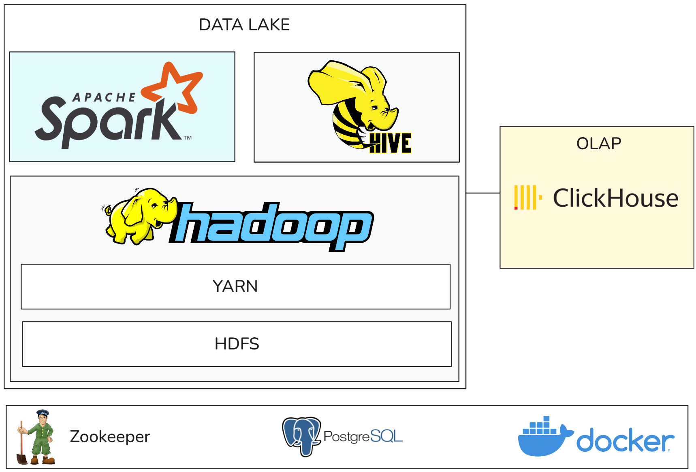
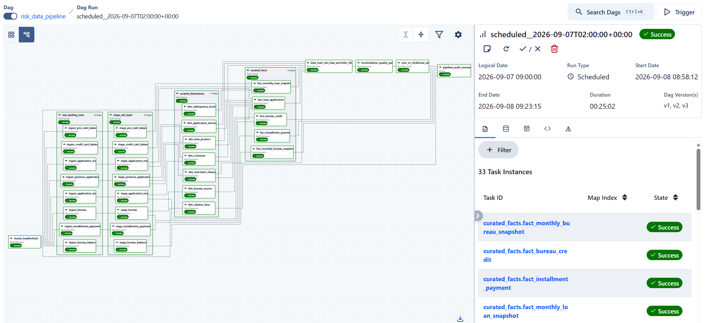

# On-premise Data Platform with Hadoop, Spark and YARN

A local multi-container environment designed to simulate real-world on-premises enterprise Big Data architectures (commonly used in banking, telecommunications, and large enterprises that rely on Apache Hadoop as their core data platform).

This project provides a practical sandbox for hands-on learning, architectural comprehension, and performance tuning across the full data lifecycle: **HDFS (Distributed Storage) ➔ YARN (Resource Management) ➔ Apache Spark (Distributed Compute) ➔ Apache Hive (Metastore) ➔ Apache Airflow (Workflow Orchestration) ➔ ClickHouse (OLAP Serving Layer)**.

---

## 1. Architecture

<p align="center">
  
</p>

---

## 2. Core Practice & Optimization Areas

Engineering patterns and measured benchmark observations on this cluster:

### 1. HDFS Storage & Partitioning
- **Mechanism**: Snappy-compressed Parquet with dynamic partition overwrites (`spark.sql.sources.partitionOverwriteMode=dynamic`) and runtime partition coalescing via Adaptive Query Execution (AQE).
- **Observed Result**:
  - ~70% storage footprint reduction compared to raw uncompressed CSV.
  - Mitigates small-file overhead on HDFS by dynamically coalescing post-shuffle output partitions into 128MB–256MB blocks.

### 2. YARN Workload Management & Container Lifecycle
- **Mechanism**:
  - **Concurrency Ceiling via Airflow Pools**: Tasks execute under a dedicated `spark_yarn_pool` (size = 3) to prevent multiple concurrent Spark submissions from exhausting cluster memory and vCores.
  - **Shared Spark Core JARs on HDFS**: Spark runtime dependencies are pre-distributed to HDFS (`/spark-jars/*`) via `spark.yarn.jars`, eliminating the overhead of uploading ~300MB JAR archives over the network for every `spark-submit`.
  - **Memory Limits Matching Cgroups**: `yarn.nodemanager.resource.memory-mb=2048` and executor heap configurations strictly align with Docker container caps to avoid unexpected Linux OOM-killer termination.
  - **Deterministic Driver Cleanup**: Guaranteed `spark.stop()` in `finally` blocks across all job templates.
- **Observed Result**:
  - Zero zombie applications: ApplicationMasters deregister immediately upon completion or failure.
  - Job startup latency reduced by ~5–8 seconds per submission by referencing HDFS-cached Spark JARs.
  - No cluster starvation or memory thrashing under multi-stage pipeline execution.

### 3. Spark Engine & Distributed Compute Optimizations
- **Mechanism**:
  - **Broadcast Hash Joins**: Conformed dimensions (`dim_customer`, `dim_loan_product`, etc.) are explicitly broadcasted during fact table construction via `F.broadcast()`, completely eliminating expensive shuffle exchanges across executors.
  - **Distributed Surrogate Key Resolution (`xxhash64`)**: Generates deterministic 64-bit surrogate keys locally on executors using `F.xxhash64(natural_key)` instead of sequential `monotonically_increasing_id()` or database auto-increment sequences, removing all distributed coordination locks.
  - **Plan Flattening**: Single-projection lowercasing via `df.toDF(*[c.lower() for c in df.columns])` replacing iterative $O(N)$ column renaming loops.
  - **Single-Pass Metric Aggregation**: Combines data quality assertions (null PK checks) and monetary sums into a single `.select()` action per dataset.
  - **Persist-and-Count Strategy**: Caches DataFrames in memory prior to disk writes (`df.persist()`), allowing audit row counts to be computed from memory rather than re-reading Parquet files from HDFS.
  - **Strict Decimal Precision**: Enforces `Decimal(18,2)` across monetary columns (`amt_credit`, `amt_balance`, `amt_payment`) to eliminate binary floating-point drift.
  - **Adaptive Query Execution (AQE)**: `spark.sql.adaptive.coalescePartitions.enabled=true` automatically merges small post-shuffle partitions at runtime.
- **Observed Result**:
  - Catalyst AST depth reduced from 122 levels to 1 on `application_train`, eliminating JVM optimizer delays.
  - Halved audit scan passes (from 6 to 3) during financial balance reconciliation.
  - Shuffle read/write I/O reduced by ~85% in fact table joins through dimension broadcasting.
  - ~30–40% faster execution on full-overwrite batch jobs.

### 4. Hive Metastore & Kimball Modeling
- **Mechanism**: Decoupled PostgreSQL metastore, deterministic 64-bit surrogate keys generated with `xxhash64` (lock-free), and fallback rows (`sk = -1`) for referential safety.
- **Observed Result**:
  - Schema initialization guarded by process-level flags, reducing redundant DDL roundtrips to once per process.
  - Fully parallel surrogate key resolution across Spark executors without distributed locks.

### 5. Orchestration (Apache Airflow 3.2.1)
- **Mechanism**: Decoupled Airflow 3 architecture (API Server + Scheduler + DAG Processor) with TaskFlow API tracking 33 tasks, environment-based credentials, and direct task failure logging callbacks.
- **Observed Result**:
  - DAG parse latency: ~0.04s for 33 tasks.
  - Automated failure logging capturing task context, error traces, and direct log URLs for local debugging.

### 6. OLAP Serving (ClickHouse)
- **Mechanism**: ClickHouse MergeTree with an atomic staging table swap (`EXCHANGE TABLES`) pattern.
- **Observed Result**:
  - Query latency: sub-10ms response times for analytical aggregations and dashboard filters.
  - Zero-downtime serving: readers never encounter empty or locked tables during batch reloads.

### 7. Data Quality & Governance
- **Mechanism**:
  - Dead-Letter Queue (DLQ) routing rejected records to `/quarantine/credit_risk/*`.
  - Financial reconciliation circuit-breaker asserting $|\Delta \sum \text{amt\_credit}| \le 0.01\%$.
  - PII protection (salted SHA-256 tokenization, string masking, income binning) and externalized secrets via `.env`.
- **Observed Result**:
  - Clean Curated/Mart layers: invalid or duplicate natural keys are isolated before downstream propagation.
  - Zero plaintext credentials stored in repository code or compose configurations.

---

## 3. Cluster Components (10 Containers)

| Container | Host Ports | Services & Responsibilities |
| :--- | :--- | :--- |
| **`master`** | `9870`, `8088`, `18080`, `19888`, `9083`, `9000` | HDFS NameNode, YARN ResourceManager, Hive Metastore, Spark History Server |
| **`worker1`** | Internal | HDFS DataNode 1, YARN NodeManager 1 |
| **`worker2`** | Internal | HDFS DataNode 2, YARN NodeManager 2 |
| **`clickhouse`** | `8123` (HTTP), `9004` (Native TCP) | ClickHouse OLAP Server for real-time analytical queries |
| **`hive-db`** | `5432` | PostgreSQL 15 RDBMS storing Hive Metastore schema |
| **`zookeeper`** | `2181` | ZooKeeper 3.8 Cluster Coordinator |
| **`airflow-webserver`** | `8085` | Apache Airflow 3.2.1 Web UI & API Server (FastAPI / React) |
| **`airflow-scheduler`** | Internal | Apache Airflow 3.2.1 Pipeline Scheduler & Executor |
| **`airflow-dag-processor`**| Internal | Apache Airflow 3.2.1 DAG Parser & Bundle Sync |
| **`airflow-db`** | Internal | PostgreSQL 15 RDBMS for Airflow Metadata |

---

## 4. Resource Allocation & Limits

Configured with strict resource caps to prevent resource exhaustion on local development machines (WSL2 / Docker Desktop):

| Service | Memory Limit | CPU Limit |
| :--- | :--- | :--- |
| `master` | 3.5 GB | 2.0 |
| `worker1` | 2.25 GB | 1.5 |
| `worker2` | 2.25 GB | 1.5 |
| `clickhouse` | 1.0 GB | 0.5 |
| `airflow-webserver` | 1.0 GB | 0.8 |
| `airflow-scheduler` | 1.0 GB | 0.8 |
| `airflow-dag-processor` | 512 MB | 0.5 |
| `hive-db` | 512 MB | 0.3 |
| `airflow-db` | 384 MB | 0.3 |
| `zookeeper` | 512 MB | 0.2 |

---

## 5. Quick Start Guide

### Step 1: Start the Cluster
```bash
make up
# or: docker-compose up -d
```
*The master container automatically performs background bootstrap (initializing HDFS directories, uploading sample datasets, distributing Spark JARs, and creating ClickHouse schemas).*

### Step 2: Check Cluster Health
```bash
make status
```

### Step 3: Run Verification Test Suite
Executes a 5-layer verification suite covering HDFS, YARN MapReduce, PySpark on YARN, Hive table creation, and ClickHouse OLAP queries:
```bash
make test
```

### Step 4: Run End-to-End Enterprise Pipeline (CLI or Airflow)
```bash
# Option A: Execute via Spark Submit directly on Master
docker exec master spark-submit --master yarn /pipeline/examples/spark_to_clickhouse_etl.py

# Option B: Trigger Airflow Risk Data Pipeline DAG
docker exec airflow-scheduler airflow dags trigger risk_data_pipeline
```

#### Airflow Pipeline Topology (`risk_data_pipeline`):
<p align="center">
  
</p>

### Step 5: Stop the Cluster
```bash
# Stop containers (preserves persistent volumes):
make down

# Stop and purge all data volumes:
make clean
```

---

## 6. Web Interfaces

- **Apache Airflow 3.2.1 UI**: [http://localhost:8085](http://localhost:8085) (`admin` / `admin`)
- **JupyterLab (Interactive PySpark)**: [http://localhost:8888/lab](http://localhost:8888/lab)
- **HDFS NameNode**: [http://localhost:9870](http://localhost:9870)
- **YARN ResourceManager**: [http://localhost:8088](http://localhost:8088)
- **Spark History Server**: [http://localhost:18080](http://localhost:18080)
- **MapReduce JobHistory**: [http://localhost:19888](http://localhost:19888)
- **ClickHouse Web Client**: [http://localhost:8123/play](http://localhost:8123/play)

---

## 7. Additional Documentation

- [Enterprise Data Governance & Protection Specification](docs/GOVERNANCE.md)
- [Spark Engine & Pipeline Optimizations](docs/optimization/spark-pipeline-optimization.md)
- [Pipeline Architecture & Layer Design](docs/PIPELINE.md)
- [Workflow Orchestration & Airflow 3 Guide](docs/ORCHESTRATION.md)
- [Platform Architecture Guides (Airflow, Spark, ClickHouse, Hadoop, Hive, YARN)](docs/platform/)
- [Practice Plan & Data Lake Modeling (Home Credit)](docs/PLAN.md)
- [Operations Runbook](docs/RUNBOOK.md)
- [Architecture & Network Ports](docs/ARCHITECTURE.md)
- [Troubleshooting & FAQ](docs/TROUBLESHOOTING.md)
