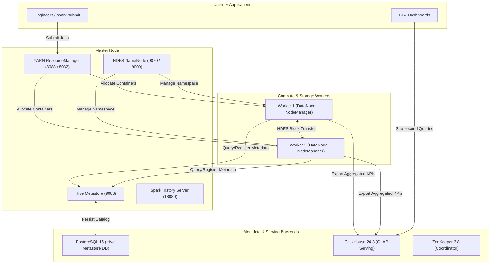

# Big Data Platform Architecture: Data Lake, Hive Warehouse & OLAP Serving

## 1. System Architecture Overview

This platform implements a standard enterprise Big Data architecture orchestrated via Docker Compose (6 lightweight containers):

---

## 2. Container Role Breakdown

1. **`zookeeper`**: ZooKeeper 3.8 providing service discovery and cluster coordination.
2. **`hive-db`**: PostgreSQL 15 relational storage for Hive & Spark SQL Metastore schemas.
3. **`clickhouse`**: ClickHouse 24.3-alpine C++ columnar OLAP engine for real-time analytics with sub-10ms query latency.
4. **`master`**: Central controller hosting HDFS NameNode, YARN ResourceManager, JobHistoryServer, Hive Metastore, HiveServer2, Spark History Server, and interactive CLI tooling.
5. **`worker1`**: Worker node running HDFS DataNode (storage blocks) and YARN NodeManager (container tasks).
6. **`worker2`**: Second worker node enabling distributed replication and parallel computation.

---

## 3. Network & Port Allocation Map

| Service | Container | Host Port | Protocol | Purpose |
|---|---|---|---|---|
| **HDFS NameNode UI** | `master` | `9870` | HTTP | Cluster storage overview & filesystem browser |
| **HDFS NameNode RPC**| `master` | `9000` | IPC | Client filesystem communications |
| **YARN ResourceManager UI** | `master` | `8088` | HTTP | YARN cluster capacity & active application tracking |
| **YARN RM AppMaster**| `master` | `8032` | IPC | ApplicationMaster job submission |
| **MapReduce JobHistory UI** | `master` | `19888`| HTTP | Completed MapReduce metrics and task logs |
| **Spark History Server** | `master` | `18080`| HTTP | Visual DAG, stage execution, and executor metrics |
| **HiveServer2 Web UI**| `master` | `10002`| HTTP | Active SQL session monitoring |
| **Hive JDBC/ODBC** | `master` | `10000`| Thrift | SQL connections (Beeline, DBeaver, BI tools) |
| **Hive Metastore** | `master` | `9083` | Thrift | Metadata catalog RPC for Hive and Spark |
| **ClickHouse HTTP UI**| `clickhouse` | `8123` | HTTP | Web Query Client (`/play`) and REST API |
| **ClickHouse Native TCP**| `clickhouse` | `9004` | TCP | Native protocol client connection |
| **ZooKeeper Client** | `zookeeper` | `2181` | TCP | Client coordination port |
| **PostgreSQL Database**| `hive-db` | `5432` | TCP | Metastore database connection |
