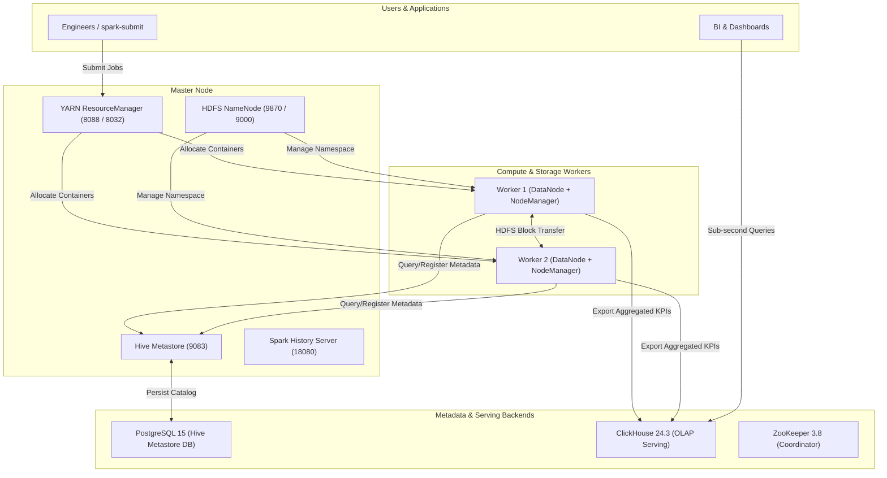

# Big Data Platform Architecture: Data Lake, Hive Warehouse & OLAP Serving

## 1. System Architecture Overview

This platform implements a standard enterprise Big Data architecture orchestrated via Docker Compose (6 lightweight containers):

```mermaid
flowchart TD
    subgraph Client["Users & Applications"]
        BI["BI & Dashboards"]
        DEV["Engineers / spark-submit"]
    end

    subgraph Master["Master Node"]
        NN["HDFS NameNode (9870 / 9000)"]
        RM["YARN ResourceManager (8088 / 8032)"]
        HMS["Hive Metastore (9083)"]
        SHS["Spark History Server (18080)"]
    end

    subgraph Workers["Compute & Storage Workers"]
        W1["Worker 1 (DataNode + NodeManager)"]
        W2["Worker 2 (DataNode + NodeManager)"]
    end

    subgraph Backends["Metadata & Serving Backends"]
        PG["PostgreSQL 15 (Hive Metastore DB)"]
        CH["ClickHouse 24.3 (OLAP Serving)"]
        ZK["ZooKeeper 3.8 (Coordinator)"]
    end

    DEV -->|Submit Jobs| RM
    RM -->|Allocate Containers| W1
    RM -->|Allocate Containers| W2
    W1 <-->|HDFS Block Transfer| W2
    NN -->|Manage Namespace| W1
    NN -->|Manage Namespace| W2
    HMS <-->|Persist Catalog| PG
    W1 & W2 -->|Query/Register Metadata| HMS
    W1 & W2 -->|Export Aggregated KPIs| CH
    BI -->|Sub-second Queries| CH
```

---

## 2. Container Role Breakdown

1. **`zookeeper`**: ZooKeeper 3.8 providing service discovery and cluster coordination.
2. **`postgres`**: Unified PostgreSQL 15 multi-tenant database hosting catalogs for Hive Metastore (`metastore`), CRM source data (`source_crm`), Airflow 3 (`airflow`), and Superset (`superset`).
3. **`clickhouse`**: ClickHouse 24.3-alpine C++ columnar OLAP engine for real-time analytics with sub-10ms query latency.
4. **`master`**: Central controller hosting HDFS NameNode, YARN ResourceManager, JobHistoryServer, Hive Metastore, HiveServer2, Spark History Server, and CLI tooling.
5. **`worker1`**: Compute & storage worker running HDFS DataNode and YARN NodeManager.
6. **`worker2`**: Second worker node enabling distributed block replication and parallel compute containers.
7. **`airflow-webserver`**: Airflow 3 Web UI and decoupled FastAPI Execution API server.
8. **`airflow-scheduler`**: Airflow 3 scheduler evaluating dependency graphs and dispatching tasks.
9. **`airflow-dag-processor`**: Standalone daemon for isolated DAG parsing and bundle synchronization.
10. **`superset`**: Apache Superset BI platform built from custom Dockerfile with pre-installed ClickHouse and Postgres drivers.

---

## 3. Network & Port Allocation Map

| Service | Container | Host Port | Protocol | Purpose |
|---|---|---|---|---|
| **HDFS NameNode UI** | `master` | `9870` | HTTP | Cluster storage overview & filesystem browser |
| **HDFS NameNode RPC**| `master` | `9000` | IPC | Client filesystem communications |
| **YARN ResourceManager UI** | `master` | `8088` | HTTP | YARN cluster capacity & active application tracking |
| **YARN RM AppMaster**| `master` | `8032` | IPC | ApplicationMaster job submission |
| **MapReduce JobHistory UI** | `master` | `19888`| HTTP | Completed MapReduce metrics and task logs |
| **Spark History Server** | `master` | `18080`| HTTP | Visual DAG, stage execution, and executor metrics |
| **HiveServer2 Web UI**| `master` | `10002`| HTTP | Active SQL session monitoring |
| **Hive JDBC/ODBC** | `master` | `10000`| Thrift | SQL connections (Beeline, DBeaver, BI tools) |
| **Hive Metastore** | `master` | `9083` | Thrift | Metadata catalog RPC for Hive and Spark |
| **ClickHouse HTTP UI**| `clickhouse` | `8123` | HTTP | Web Query Client (`/play`) and REST API |
| **ClickHouse Native TCP**| `clickhouse` | `9004` | TCP | Native protocol client connection |
| **ZooKeeper Client** | `zookeeper` | `2181` | TCP | Client coordination port |
| **PostgreSQL Database**| `postgres` | `5433` (mapped from 5432) | TCP | Multi-tenant relational catalog |
| **Airflow 3 Webserver**| `airflow-webserver` | `8085` (mapped from 8080) | HTTP | Web orchestration dashboard |
| **Apache Superset** | `superset` | `8089` (mapped from 8088) | HTTP | Enterprise BI visualization dashboards |

---

## 4. Security & Cryptographic Architecture

1. **Zero Hardcoded Secrets**: All passwords, API keys, and connection strings are injected at runtime from `.env` (template provided in `.env.example`).
2. **Fernet Credential Encryption**: Airflow connection credentials and variable values stored in PostgreSQL are encrypted at rest using AES-128-CBC with PKCS7 padding (`AIRFLOW__CORE__FERNET_KEY`).
3. **Execution API JWT Security**: Internal communication between Airflow TaskRunner processes and the API server requires cryptographically signed JWT tokens (`AIRFLOW__API_AUTH__JWT_SECRET`).
4. **Secret Generation Automation**: `make gen-secrets` generates secure, URL-safe random tokens for immediate cluster provisioning.
5. **Database Privilege Segregation**: Discrete database users (`hive`, `airflow`, `superset`) maintain isolated credentials and access boundaries.
