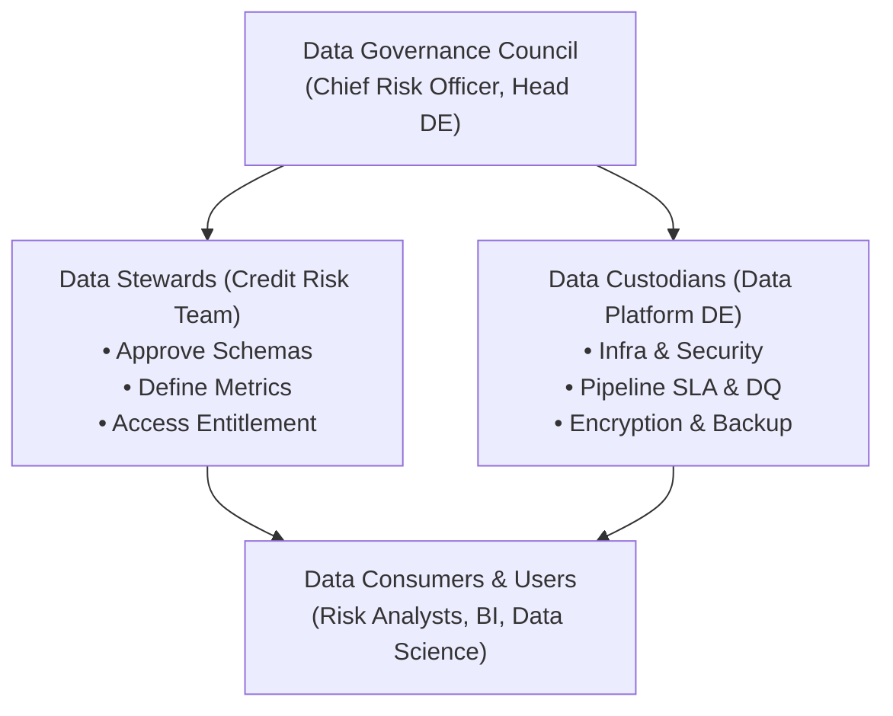
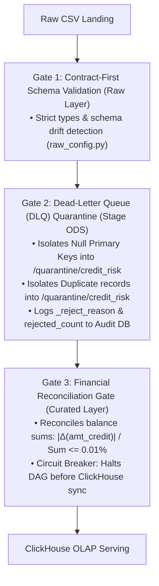

# Enterprise Data Governance & Protection Specification
### FinTech Credit Risk Data Platform

---

## 1. Governance Framework & Operating Model

The data platform adopts the **DAMA-DMBOK** (Data Management Body of Knowledge) standard, integrated with **BCBS 239** (Basel Committee on Banking Supervision - Risk Data Aggregation and Risk Reporting) principles and data privacy compliance standards (e.g., GDPR, Vietnam Decree 13/2023/ND-CP):

### RACI Matrix

| Process / Data Asset | Data Owner (Risk) | Data Steward | Data Custodian (DE) | Data Consumer |
|---|:---:|:---:|:---:|:---:|
| **Schema & Metric Definitions** | **A** (Accountable) | **R** (Responsible) | **C** (Consulted) | **I** (Informed) |
| **Data Classification & PII Policy** | **A** | **R** | **C** | **I** |
| **Pipeline Operations & SLA Monitoring** | **I** | **C** | **A / R** | **I** |
| **Error Handling (DLQ Quarantine)** | **I** | **A** (Approve Fixes) | **R** (Remediate) | **I** |
| **Access Control & Entitlement** | **A** | **R** (Vetting) | **R** (Configure) | **C** |

---

## 2. Data Classification Matrix

All datasets and attributes within the Data Lake are classified into four tiers:

| Tier | Classification | Definition | Storage & Access Control Policy |
|---|---|---|---|
| **L1** | **Public** | Non-identifiable reference codes (table names, generic status codes). | Unrestricted internal access. |
| **L2** | **Internal** | Pipeline operational metadata: batch IDs, execution logs, hashed SKs. | Restricted to technical platform engineers and system accounts. |
| **L3** | **Confidential** | Material financial figures: credit amount (`amt_credit`), annuity, installments, days past due (DPD), credit bureau scores. | Enforced via Role-Based Access Control (RBAC). Strict authentication required. |
| **L4** | **Restricted (PII)** | Direct or quasi-identifiers: natural client keys (`sk_id_curr`), exact total income (`amt_income_total`), demographics, family status, occupation. | **Mandatory Masking or Tokenization** before exposure to analytics and BI layers. |

### Detailed Attribute Classification Mapping

| Dataset | Attribute Name | Tier | Security Treatment (Stage & Curated) |
|---|---|:---:|---|
| `dim_customer` | `sk_id_curr` | **L4 (PII)** | Surrogate key generated via `sk_customer_key = xxhash64(sk_id_curr)`. Salted SHA-256 (`tokenize_id`) if exported. |
| `dim_customer` | `amt_income_total` | **L4 (PII)** | Retained as `Decimal(18,2)` in core DWH; exposed as generalized `mask_income_bracket` for self-service BI. |
| `dim_customer` | `code_gender`, `name_family_status`, `occupation_type` | **L3 / L4** | Standardized, sanitized, protected against re-identification (k-anonymity). |
| `fact_loan_application` | `amt_credit`, `amt_annuity`, `amt_goods_price` | **L3 (Confidential)** | Strict `Decimal(18,2)` casting; audited via `reconciliation_audit`. |
| `obt_loan_portfolio_360` | `target_default_flag`, `latest_dpd` | **L3 (Confidential)** | Restricted to credit risk modeling and Basel regulatory reporting. |
| All Tables | `_source_system`, `_processed_at`, `_batch_id` | **L2 (Internal)** | Standard, immutable audit columns. Modification strictly prohibited. |

---

## 3. Multi-Tier Data Quality Framework

The platform implements an automated three-tier quality control architecture to prevent dirty or malformed data from propagating into the OLAP serving layer:

### The 6 DAMA Data Quality Dimensions

1. **Completeness**:
   - Primary keys must never be `NULL`.
   - Missing mandatory attributes must fallback to conformed defaults: `"Unknown"`, `"N"`, `"XNA"`.
2. **Uniqueness**:
   - Natural business keys (`sk_id_curr`, `sk_id_prev`) are deduplicated using window ranking in `BaseStageJob`. Redundant records are routed to DLQ.
3. **Validity**:
   - Boundary checks: `amt_credit > 0`, `cnt_children >= 0`, categorical codes must belong to valid dictionaries.
4. **Consistency**:
   - Uniform `Decimal(18,2)` monetary typing across Raw $\to$ Stage $\to$ Curated $\to$ ClickHouse.
5. **Accuracy**:
   - Financial aggregate discrepancy between Stage and Mart must not exceed the strict tolerance threshold ($0.01\%$).
6. **Timeliness**:
   - Tracked per batch via `pipeline_watermark` and execution timestamps (`_processed_at`).

---

## 4. Dead-Letter Queue (DLQ / Quarantine Zone)

Previously, malformed or duplicate records were silently dropped. The platform now implements an active quarantine routing pattern:

- **HDFS / Storage Path**: `/quarantine/credit_risk/<table_name>/`
- **Configurable**: Environment variable `QUARANTINE_BASE_DIR` (defaults to `/quarantine/credit_risk`).
- **Enriched Metadata**:
  - `_reject_reason`: Violation tag (`NULL_PRIMARY_KEY`, `DUPLICATE_RECORD`, `INVALID_FORMAT`).
  - `_rejected_at`: Timestamp when record was quarantined.
  - `_batch_id`: Deterministic execution identifier.
  - `_source_table`: Origin table where the failure occurred.
- **Audit & Alerting**:
  - `BaseStageJob` automatically logs `rejected_count` to `pipeline_audit_log` in PostgreSQL.
  - If `rejected_count > 0.5%` of batch volume, an incident alert is raised to the Data Steward.

---

## 5. PII Protection & Data Privacy Standards

Implemented via the shared utility [`pipeline/src/common/security.py`](file:///d:/Projects/hadoop-spark-yarn/pipeline/src/common/security.py):

### 1. String Masking
- **Function**: `mask_string(col, keep_prefix=1, keep_suffix=1, mask_char="*")`
- **Usage**: Masks phone numbers, national IDs, and email addresses.
- **Example**: Phone `0912345678` $\to$ `0****8`.

### 2. Salted Tokenization
- **Function**: `tokenize_id(col, salt="credit_risk_salt_2026")`
- **Usage**: One-way cryptographic pseudonymization of client keys using salted SHA-256.
- **Benefit**: Enables downstream analytics and cross-system joins without exposing plain-text customer IDs.

### 3. Income Binning / Generalization
- **Function**: `mask_income_bracket(col)`
- **Usage**: Generalizes exact customer income into discrete risk brackets (k-anonymity):
  - `< 50,000` $\to$ `<50k`
  - `50,000 - 100,000` $\to$ `50k-100k`
  - `100,000 - 200,000` $\to$ `100k-200k`
  - `200,000 - 500,000` $\to$ `200k-500k`
  - `> 500,000` $\to$ `>=500k`

---

## 6. Data Lifecycle & Retention Policy

| Data Layer | Format & Storage Target | Retention Period (TTL) | Expiry Action |
|---|---|---|---|
| **Raw Landing Zone** | Parquet on HDFS `/raw/credit_risk/*` | **90 Days** | Move to Cold Storage (HDFS Archive HAR / S3 Glacier) or purge after audit. |
| **Stage ODS Layer** | Parquet on HDFS `/stage/credit_risk/*` | **180 Days** | Purged in batches or re-processed on demand. |
| **Curated DWH Core** | Parquet on HDFS `/curated/credit_risk/*` | **7 Years** | Immutable regulatory retention for central bank audit and model retraining. |
| **Quarantine Zone (DLQ)** | Parquet on HDFS `/quarantine/credit_risk/*` | **30 Days** | Investigated by Data Stewards; purged after resolution. |
| **ClickHouse OLAP Serving** | MergeTree on local container SSD | **24 Months** | Enforced via ClickHouse table TTL: `MODIFY TTL ingested_at + INTERVAL 24 MONTH`. |

---

## 7. SLA Monitoring & Incident Response

### Service Level Agreements (SLA Matrix)

| SLA Metric | Target | Measurement Tool | Breach Escalation |
|---|:---:|---|---|
| **Pipeline Delivery Time** | Completed by 06:00 AM UTC+7 daily | Airflow DAG Runtime Metrics | Automated alert via `on_failure_alert` in `risk_data_pipeline.py`. |
| **Financial Discrepancy** | $\Delta \le 0.01\%$ | `reconciliation_audit.py` | Pipeline circuit breaker triggers; sync to ClickHouse is blocked. |
| **DLQ Reject Ratio** | $\le 0.5\%$ of batch rows | `pipeline_audit_log.rejected_count` | Data Quality Incident ticket dispatched to Data Steward. |
| **Service Availability** | Uptime $\ge 99.5\%$ | Cluster Healthcheck (Airflow Task 0) | Automatic retry with exponential backoff (2 attempts, 2-minute delay). |

### Incident Remediation Playbook
1. **Detection**: Alert triggered by Airflow callback or failed reconciliation audit gate.
2. **Triage**: Query `pipeline_audit_log` using the relevant `batch_id` to isolate failing stage/layer.
3. **Quarantine Inspection**: Inspect `/quarantine/credit_risk/<table_name>/` to diagnose `_reject_reason`.
4. **Recovery**:
   - If upstream schema drift: request corrected source feed from source owners.
   - If transient data anomaly: replay partition safely using Spark dynamic partition overwrite.
