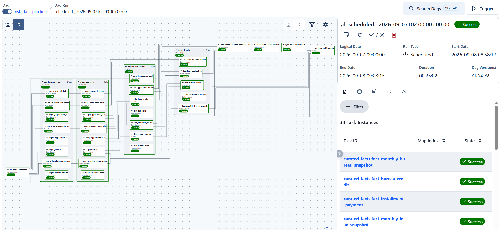

# Workflow Orchestration & DAG Architecture (Apache Airflow 3)

Technical documentation for pipeline orchestration, DAG graph design, security configuration, and concurrency management using Apache Airflow 3.2.1 on top of Hadoop YARN and Spark 3.5.

---

## 1. Apache Airflow 3 Architecture

In Airflow 3 (`apache/airflow:3.2.1`), the execution architecture is redesigned for microservice decoupling and task security:

```
┌────────────────────────────────────────────────────────┐
│             airflow-webserver (API Server)             │
│            FastAPI REST API + React Web UI             │
│                Execution API: /execution/*             │
└──────────────────────────▲─────────────────────────────┘
                           │ HTTP (JWT Auth)
┌──────────────────────────┴─────────────────────────────┐
│                    airflow-scheduler                   │
│             LocalExecutor / Task Supervisor            │
│               Spawns TaskRunner Subprocesses           │
└──────────────────────────┬─────────────────────────────┘
                           │
┌──────────────────────────▼─────────────────────────────┐
│                  airflow-dag-processor                 │
│         Isolated DAG Parsing & Bundle Sync             │
└────────────────────────────────────────────────────────┘
```

### Key Components:
- **`airflow-webserver`**: Serves both the Web UI and the new **Task Execution API** (`/execution/*`), which receives task heartbeats, state transitions, and XCom updates via HTTP.
- **`airflow-scheduler`**: Orchestrates DAG scheduling, evaluates dependency graphs, and launches worker processes. In `LocalExecutor` mode, the scheduler spawns a `Supervisor` subprocess for each task instance.
- **`airflow-dag-processor`**: Standalone daemon dedicated to parsing DAG files from `/opt/airflow/dags`, isolating user code execution from the core scheduler loop.
- **`TaskRunner` / `Supervisor`**: The task process connects back to the Execution API server using HTTP calls authenticated via JSON Web Tokens (JWT).

---

## 2. Security & Execution API Authentication

### JWT Secret Requirement (`[api_auth] jwt_secret`):
Because the TaskRunner communicates with the Execution API over HTTP, each request is signed with a JWT token.
- When `AIRFLOW__API_AUTH__JWT_SECRET` is unset, both the scheduler and webserver generate independent, ephemeral random keys in memory upon container boot.
- When a task runner attempts to report back to the API server, signature verification fails with:
  ```text
  airflow.sdk.api.client.ServerResponseError: Invalid auth token: Signature verification failed
  ```

### Production Configuration in `docker-compose.yml`:
An identical, persistent secret is mounted across all Airflow containers:
```yaml
environment:
  AIRFLOW__CORE__EXECUTION_API_SERVER_URL: 'http://airflow-webserver:8080/execution/'
  AIRFLOW__API__SECRET_KEY: 'tj3TRHkFNkiP/iGlq5lmxg=='
  AIRFLOW__API_AUTH__JWT_SECRET: 'tj3TRHkFNkiP/iGlq5lmxg=='
```

---

## 3. DAG Architecture: `risk_data_pipeline`

The primary production pipeline is defined in [pipeline/dags/risk_data_pipeline.py](file:///d:/Projects/hadoop-spark-yarn/pipeline/dags/risk_data_pipeline.py). It contains **33 tasks** structured across 4 distinct processing tiers:

<p align="center">
  
</p>

### Pipeline Topology:

1. **Step 0: Fail-Fast Cluster Connectivity Gate (`cluster_healthcheck`)**:
   - Probes NameNode (port 9870), ResourceManager (port 8088), and ClickHouse HTTP endpoint (port 8123) before any Spark task is dispatched.
2. **Layer 1: Raw Landing Zone (`raw_landing_zone`)** - 8 Tasks:
   - Parallel ingestion of source CSVs / database tables into HDFS Parquet:
     - `ingest_application_train`, `ingest_application_test`, `ingest_bureau`, `ingest_bureau_balance`,
     - `ingest_pos_cash_balance`, `ingest_credit_card_balance`, `ingest_installments_payments`, `ingest_previous_application`.
3. **Layer 2: Stage / ODS Layer (`stage_ods_layer`)** - 8 Tasks:
   - 1-to-1 downstream lineage from each Raw task.
   - Cleanses, deduplicates, and enforces `Decimal(18,2)` schema precision into Hive stage tables.
4. **Layer 3: Curated Core - Dimensions (`curated_dimensions`)** - 7 Tasks:
   - Generates conformed Kimball dimensions using deterministic `xxhash64` surrogate keys.
   - `dim_customer`, `dim_loan_product`, `dim_merchant_channel`, `dim_application_decision`, `dim_delinquency_bucket`, `dim_relative_time`, `dim_bureau_source`.
5. **Layer 4: Curated Core - Facts (`curated_facts`)** - 5 Tasks:
   - Builds constellation facts referencing dimension surrogate keys.
   - `fact_loan_application`, `fact_monthly_loan_snapshot`, `fact_installment_payment`, `fact_bureau_credit`, `fact_monthly_bureau_snapshot`.
6. **Layer 5: Data Mart (`data_mart_obt_loan_portfolio_360`)**:
   - Assembles the wide, denormalized One Big Table for BI and risk modeling.
7. **Layer 5b: Financial Reconciliation Quality Gate (`reconciliation_quality_gate`)**:
   - Automated financial assertion verifying $\Delta(\sum \text{amt\_credit}) \le 0.01\%$ and zero NULL primary keys.
8. **Layer 6: OLAP Serving Sync (`sync_to_clickhouse_olap`)**:
   - Ingests Parquet data into staging table and executes zero-downtime atomic swap (`EXCHANGE TABLES`).
9. **Layer 7: Terminal Join Barrier (`pipeline_audit_summary`)**:
   - Terminal barrier ensuring the pipeline run is only marked finished when all fact/dimension branches and the OLAP serving layer complete successfully.

---

## 4. Key Design Patterns & Protections

### A. Terminal Join Barrier (Preventing Dangling Nodes)
- **Problem**: In a branched DAG, if the final task only depends on the Data Mart branch, other independent fact tables (e.g., `fact_installment_payment`, `fact_bureau_credit`) become dangling leaf nodes. Airflow would mark the DAG run "SUCCESS" while several Spark jobs were still active on YARN.
- **Solution**: The terminal audit summary task gates on **all** terminal tasks:
  ```python
  [
      sync_to_clickhouse,
      facts["fact_installment"],
      facts["fact_bureau_cred"],
      facts["fact_monthly_bureau"],
      dims["dim_rel_time"],
  ] >> audit_summary
  ```

### B. Concurrency Management (`spark_yarn_pool`)
- **Problem**: YARN CapacityScheduler limits the percentage of cluster memory available to ApplicationMasters (`yarn.scheduler.capacity.maximum-am-resource-percent`). On a 4GB local cluster, the AM limit is 1024MB, allowing only 1-2 active AMs simultaneously. Triggering 16+ Spark tasks concurrently floods YARN into `ACCEPTED` status.
- **Solution**: All Spark tasks are bound to an Airflow concurrency pool configured with **3 slots**:
  ```python
  def build_spark_task(task_id: str, layer: str, script: str) -> BashOperator:
      return BashOperator(
          task_id=task_id,
          bash_command=f"bash /opt/airflow/scripts/ops/submit_spark_job.sh {layer} {script} '{{{{ run_id }}}}' ",
          pool="spark_yarn_pool",
          env={"BATCH_ID": "{{ run_id }}"},
      )
  ```

### C. Airflow 3 Template Context Compatibility
- **Problem**: In Airflow 3, manual runs without a specified `logical_date` set `dag_run.logical_date = None`. Legacy template variables such as `{{ ts_nodash }}` raise `jinja2.UndefinedError`.
- **Solution**: Use `{{ run_id }}` as the universal, deterministic execution tag passed down to Spark jobs for audit metadata and lineage.

---

## 5. Operations & CLI Reference

### Trigger & Manage Pipeline:
```bash
# List active DAGs
docker exec airflow-scheduler airflow dags list

# Unpause the pipeline
docker exec airflow-scheduler airflow dags unpause risk_data_pipeline

# Trigger an immediate run
docker exec airflow-scheduler airflow dags trigger risk_data_pipeline

# Check execution state of a specific DAG run
docker exec airflow-scheduler airflow dags list-runs risk_data_pipeline
docker exec airflow-scheduler airflow tasks states-for-dag-run risk_data_pipeline <RUN_ID>
```

### Clear & Re-run Tasks:
```bash
# Clear all tasks for the latest run to force a complete re-execution
docker exec airflow-scheduler airflow tasks clear risk_data_pipeline -y
```
